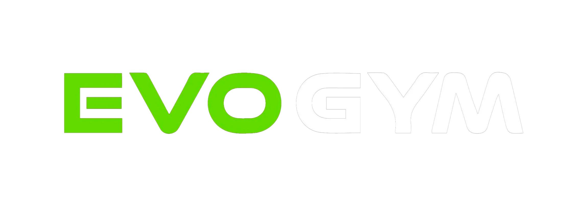

# 🏋️‍♂️ EvoGym Web Application



> **EvoGym** es más que un gimnasio; es una comunidad enfocada en el desarrollo físico y mental. Esta aplicación web ofrece una experiencia moderna, rápida y dinámica para conocer todo lo que nuestro centro de entrenamiento tiene para ofrecer.

---

## 📖 Índice

- [Acerca del Proyecto](#acerca-del-proyecto)
- [Características Principales](#características-principales)
- [Tecnologías Usadas](#tecnologías-usadas)
- [Estructura del Proyecto](#estructura-del-proyecto)
- [Instalación y Configuración Local](#instalación-y-configuración-local)
- [Scripts Disponibles](#scripts-disponibles)
- [Optimización SEO](#optimización-seo)

---

## 🌟 Acerca del Proyecto

La aplicación web de **EvoGym** está diseñada para proporcionar una presencia digital premium y atractiva para el gimnasio. Desarrollada con las últimas tecnologías web, la plataforma es completamente responsiva, rápida y está adaptada para ofrecer una excelente experiencia de usuario (UX) en cualquier dispositivo.

En ella, nuestros usuarios pueden explorar:
- Nuestros planes de membresía.
- Instalaciones especializadas.
- Clases, horarios y servicios adicionales.
- Venta de suplementos con asesoría nutricional.

---

## ✨ Características Principales

- **Diseño Premium y Responsivo:** Paleta de colores distintiva (Verde y Negro), con una interfaz adaptativa (Mobile, Tablet, Desktop) y animaciones fluidas.
- **Sección de Membresías y Servicios:** Detalles claros sobre planes (Anual, Mensual, Diario) y servicios (Cardio, Pesas, Pilates, Yoga, Spinning, etc.).
- **Venta de Productos y Suplementos:** Área dedicada para conocer y adquirir suplementos.
- **Barra de Navegación y Footer Integrados:** Navegación fluida por todas las secciones (Hero, Schedule, About, Location, Contact, etc.).
- **SEO Avanzado:** Optimización profunda con Metadatos (OpenGraph, Twitter Cards), `sitemap.xml`, `robots.txt`, y JSON-LD adaptado para negocios locales.

---

## 🛠️ Tecnologías Usadas

El proyecto está construido con un stack moderno enfocado en la velocidad y el rendimiento:

- **Framework Core:** [Next.js (v16.2.1)](https://nextjs.org/)
- **Librería UI:** [React (v19.2.4)](https://react.dev/)
- **Estilos:** [Tailwind CSS (v4)](https://tailwindcss.com/)
- **Animaciones:** [Framer Motion](https://www.framer.com/motion/)

---

## 🚀 Instalación y Configuración Local

Sigue estos pasos para ejecutar el proyecto en tu entorno local:

1. **Clona el repositorio:**
   ```bash
   git clone <URL_DEL_REPOSITORIO>
   cd evogym-web
   ```

2. **Instala las dependencias:**
   ```bash
   npm install
   ```

3. **Inicia el servidor de desarrollo:**
   ```bash
   npm run dev
   ```

4. **Abre el proyecto en tu navegador:**
   Navega a [http://localhost:3000](http://localhost:3000) para ver la aplicación funcionando.

---

## 📜 Scripts Disponibles

En el directorio principal, puedes ejecutar:

- `npm run dev`: Inicia la aplicación en modo desarrollo.
- `npm run build`: Compila la aplicación para producción.
- `npm run start`: Inicia el servidor de producción.
- `npm run lint`: Ejecuta ESLint para analizar el código en busca de problemas.

---

## 🔍 Optimización SEO

EvoGym Web está diseñado para tener la **máxima visibilidad orgánica** y un excelente posicionamiento local en Google gracias a:

- Uso avanzado de metadatos.
- Marcado semántico HTML5.
- Estructura optimizada y generación de sitemaps.

---

**¡Gracias por visitar EvoGym! ¡Entrena duro, evoluciona siempre!** 💪
